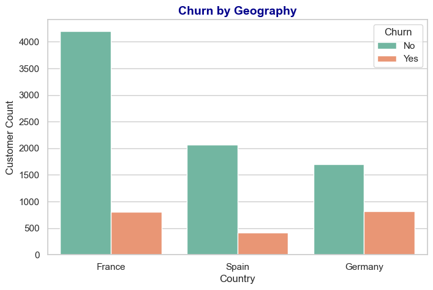
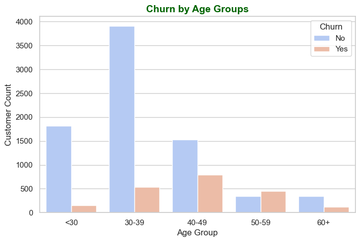
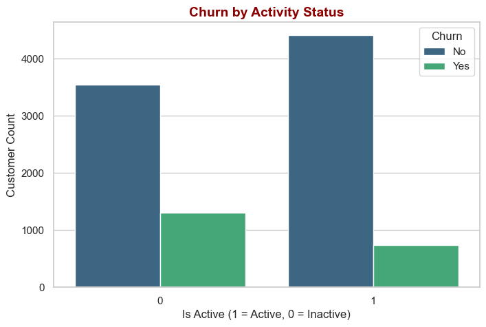

#  Insights from Customer Churn Analysis  

# Churn by Geography  
- Customers from **Germany** show significantly higher churn rates compared to Spain and France.  
- This suggests possible **regional issues** (e.g., competition, service satisfaction, or local economic factors) that need targeted action.  

  

**Business Insight:** Focus retention campaigns more heavily in **Germany**, such as loyalty programs, region-specific offers, or improving service satisfaction.  

---

# Churn by Age Groups  
- The highest churn is observed among customers aged **40–50 years old**.  
- Younger customers (20–30) and older customers (60+) show relatively lower churn rates.  

  

**Business Insight:** Mid-aged customers may have **higher financial commitments** (loans, mortgages) and may switch providers for better deals. Personalized financial products or flexible credit offerings could improve retention in this group.  

# Churn by Activity Status  
- **Inactive customers** are far more likely to churn compared to active customers.  
- Activity here represents product usage, account engagement, or regular transactions.  

  

**Business Insight:** Engaging inactive customers through **targeted reactivation campaigns** (e.g., reminders, incentives for usage, or exclusive offers) could significantly reduce churn.  

# Model Interpretability (Feature Importance)  
- The model shows that **Age, Activity Status, Balance, and Geography** are the strongest predictors of churn.  
- This confirms the visualization insights and provides **trust in model decisions**.  

**Business Insight:** These features can be directly used to **build customer risk profiles**, allowing the business to proactively target customers most likely to churn.  

# Overall Business Takeaway  
Churn is driven primarily by:  
- **Regional factors (Germany)**  
- **Demographic factors (40–50 age group)**  
- **Behavioral factors (inactive customers)**  

 Addressing these areas with **personalized, data-driven retention strategies** will likely reduce churn rates significantly.  